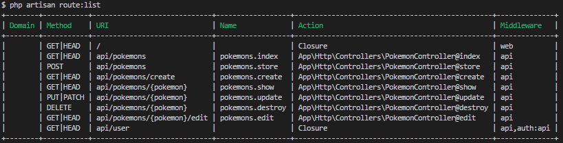
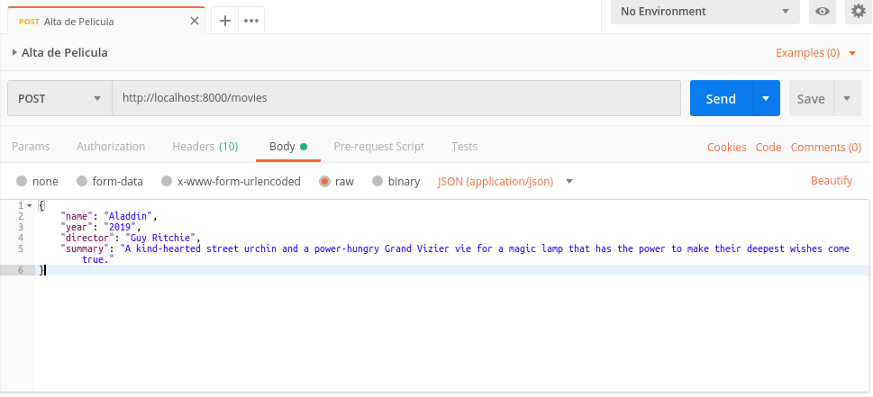
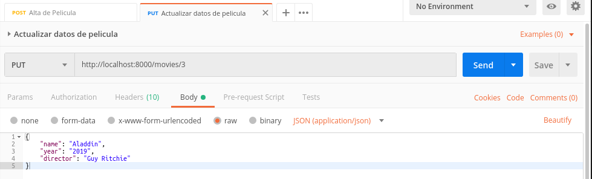
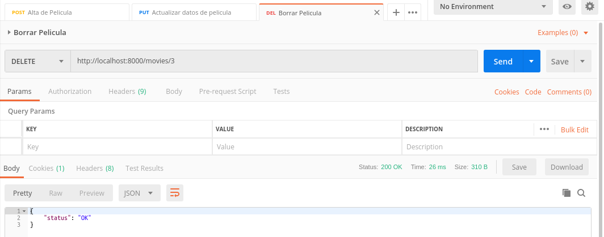

# API REST con Slim micro-framework

Este tutorial pretende ser una referencia y ejemplo de como crear una sencilla API rest. Se integran tecnologias y herramientas que se consideran modernas en el desarrollo (frameworks, migrations) que no estan directamente relacionadas con API pero que ayudan a la generación y ciclo de vida de los proyectos.

## Indice

1. [Introducción a REST](01-theory.md)
2. [Instalación inicial](02-setup.md)
3. [Configuración y manejo de datos](03-db.md)
4. [Creación de Repositorio](04-git.md)
5. [Primer Ruta](05-first-endpoint)
6. [Conectando el modelo a la base de datos](06-db-connect.md)
7. [Agregando más endpoints](07-more-endpoints.md)
8. [Cuestiones finales](08-final.md)

### old

Algunas notas sobre crear APIs



## 1. Dependencias

```bash
sudo apt-get install php-xml
```

## 2. Instalación

```bash
composer create-project slim/slim-skeleton ~/workspace/slim-api
composer require vlucas/phpdotenv
composer require robmorgan/phinx
composer require fzaninotto/faker
```

Esto crea el esqueleto de una app con muchas cosas ya cargadas (logger, templates, etc...)

## 2.1 Ejecutar proyecto

```bash
cd ~/workspace/slim-api
php -S localhost:8000 -t public
```

## 3. Agregando base de datos

en dependencies.php

```php
$container['db'] = function ($c) {
    $db = $c['settings']['db'];
    $pdo = new PDO('mysql:host=' . $db['host'] . ';dbname=' . $db['dbname'],
        $db['user'], $db['pass']);
    $pdo->setAttribute(PDO::ATTR_ERRMODE, PDO::ERRMODE_EXCEPTION);
    $pdo->setAttribute(PDO::ATTR_DEFAULT_FETCH_MODE, PDO::FETCH_ASSOC);
    return $pdo;
};
```

en settings.php

```php
'db' => [
    'host' => getenv('DATABASE_HOST'),
    'dbname' => getenv('DATABASE_NAME'),
    'user' => getenv('DATABASE_USER'),
    'pass' => getenv('DATABASE_PASS')
]
```

Para usar la funcion env hay que cargar la lib dotenv al inicio public/index.php

```php
// Load dotenv lib LINE 16
$dotenv = Dotenv\Dotenv::create(__DIR__ . '/..');
$dotenv->load();
```

Ademas de crear el archivo .env (hay un .env.example)

```bash
cp .env.example .env
nano .env
```

Y agregar .env a .gitignore

### 3.1 Creando la base de datos

Crear la base de datos configurada en MySQL:

```bash
$ mysql -u paw -p
mysql> CREATE SCHEMA slim_api ;
Query OK, 1 row affected (0.00 sec)

mysql> exit;
Bye
$ 
```

### 3.2 Creando migrations con phinx

```bash
vendor/bin/phinx -h
vendor/bin/phinx init . -f php
```

Editar el archivo `phinx.php` y poner el contenido tal como sigue:

```php
<?php
(Dotenv\Dotenv::create(__DIR__))->load();

return
[
    'paths' => [
        'migrations' => '%%PHINX_CONFIG_DIR%%/db/migrations',
        'seeds' => '%%PHINX_CONFIG_DIR%%/db/seeds'
    ],
    'environments' => [
        'default_migration_table' => 'phinxlog',
        'default_database' => 'development',
        'production' => [
            'adapter' => 'mysql',
            'host' => getenv('DATABASE_HOST'),
            'name' => getenv('DATABASE_NAME'),
            'user' => getenv('DATABASE_USER'),
            'pass' => getenv('DATABASE_PASS'),
            'port' => '3306',
            'charset' => 'utf8',
        ],
        'development' => [
            'adapter' => 'mysql',
            'host' => getenv('DATABASE_HOST'),
            'name' => getenv('DATABASE_NAME'),
            'user' => getenv('DATABASE_USER'),
            'pass' => getenv('DATABASE_PASS'),
            'port' => '3306',
            'charset' => 'utf8',
        ],
        'testing' => [
            'adapter' => 'mysql',
            'host' => getenv('DATABASE_HOST'),
            'name' => getenv('DATABASE_NAME'),
            'user' => getenv('DATABASE_USER'),
            'pass' => getenv('DATABASE_PASS'),
            'port' => '3306',
            'charset' => 'utf8',
        ]
    ],
    'version_order' => 'creation'
];
```

(esto reutiliza el archivo .env)

A continuación crearemos nuestro migration

```bash
mkdir -p db/migrations db/seeds
vendor/bin/phinx create CreateTableMovies
```

Editar el archivo creado en `~/workspace/slim-api/db/migrations/`

```php
<?php

use Phinx\Migration\AbstractMigration;

class CreateTableMovies extends AbstractMigration
{
    public function change()
    {
        $movies = $this->table('movies');
        $movies->addColumn('name', 'text')
                ->addColumn('year', 'text')
                ->addColumn('director', 'text')
                ->addColumn('summary', 'text')
                ->create();
    }
}
```

Luego podemos realizar la creación de la tabla

```bash
vendor/bin/phinx migrate -e development
```

Creara la tabla en la base.

## 4. Creando repo y agregando control de versiones

```bash
cd ~/workspace/slim-api
git init
git remote add origin https://gitlab.com/pawunlu/slim-api.git
git add .
git commit -m "Initial commit"
git push -u origin master
```

## 5. Creando la primer ruta

Trataremos de usar un enfoque basado en MVC mientras sea posible.

Creamos el archivo `app/controllers/MovieController.php`

```php
<?php

namespace Api\Controller;

use Api\Model\Movie;

class MovieController {
    function __construct(Movie $model, \Slim\Container $container) {
        $this->model = $model;
        $this->container = $container;
    }

    function test($request, $response, $args) {
        $movies = [
            '1' => [
                'name' => 'Pulp Fiction',
                'director' => 'Quentin Tarantino'
            ],
            '2' => [
                'name' => 'Rear Window',
                'director' => 'Alfred Hitchcock'
            ]
        ];
        return $response->withJson($movies);
    }
}
```

Ademas creamos `app/models/Movie.php`

```php
<?php

namespace Api\Model;

/**
 *
 */
class Movie
{
    function __construct(\PDO $db)
    {
        $this->db = $db;
    }
}

```

Y lo agregamos al inyector de dependencias en dependencies.php

```php
$container['MovieController'] = function ($c) {
    $model = new \Api\Model\Movie($c['db']);
    return new \Api\Controller\MovieController($model, $c);
};
```

Y agregamos la carga de las clases al autoload:

```json
"autoload": {
    "psr-4": {
        "App\\Controller\\": "app/controllers",
        "Api\\Model\\": "app/models"
    }
},
```

Luego ejecutamos `composer dump-autoload`.

Ademas hay que crear la ruta en src/routes.php:

```php
$app->get('/movies/test', 'MovieController:test');
```

A continuación corremos el server:

```bash
php -S localhost:8000 -t public
```

ir a http://localhost:8000/movies/test

## 6. Modelo conectado a la base de datos

- Generar un seeder para la tabla Movies y ejecutarlo
- Generar a nivel del modelo métodos de consulta (individual y todos)
- Hacer que el controller hable con el modelo
- Generar la ruta adecuada

### 6.1 Seeder de Movies

```bash
vendor/bin/phinx seed:create MovieSeeder
```

Editamos el archivo de seed, y usando la librería Faker, generamos datos de prueba

```php
<?php

use Phinx\Seed\AbstractSeed;

class MovieSeeder extends AbstractSeed
{
    public function run()
    {
        $faker = Faker\Factory::create();
        $data = [];
        for ($i=0; $i < 50; $i++) {
            $data[] = [
                'name' => $faker->words(5, true),
                'year' => $faker->year($max = 'now'),
                'director' => $faker->name(),
                'summary' => $faker->text(350)
            ];
        };
        $this->table('movies')->insert($data)->save();
    }
}

```

Y se ejecuta el seeder

```bash
php vendor/bin/phinx seed:run -s MovieSeeder -e development
```

Revisar la tabla y ver los registros creados

### 6.2 Mejorar el modelo para que consulte la base

En el modelo Movie.php podemos armar la consulta para una pelicula

```php
<?php

namespace Api\Model;

/**
 *
 */
class Movie
{
    function __construct(\PDO $db)
    {
        $this->db = $db;
    }

    function select($id)
    {
        $sentencia = $this->db->prepare("SELECT * FROM movies WHERE id = :id");
        $sentencia->execute(compact('id'));
        return $sentencia->fetch();
    }
}
```

### 6.3 Armar metodo en controller

Agregar este método a MovieController.php

```php
function show($request, $response, $args)
{
	$movie = $this->model->select($args['id']);
	return $response->withJson($movie);
}
```

### 6.4 Agregar ruta al ruteador

En src/routes.php agregar

```php
$app->get('/movies/{id}', 'MovieController:show');
```

Para probar: http://localhost:8000/movies/5

### 6.5 Retornar todas las peliculas

Algunas cosas podemos tocar para que se puedan obtener todas las peliculas

routes.php

```php
return function (App $app) {
    $container = $app->getContainer();

    $app->get('/movies/test', 'MovieController:test');
    $app->get('/movies', 'MovieController:index');
    $app->get('/movies/{id}', 'MovieController:show');
};
```

MovieController.php

```php
function index($request, $response, $args)
{
	$movies = $this->model->selectAll();
    return $response->withJson($movies);
}
```

Movie.php

```php
function selectAll()
{
    $sentencia = $this->db->prepare("SELECT * FROM movies");
    $sentencia->execute();
    return $sentencia->fetchAll();
}
```

Y probar en http://localhost:8000/movies

## 7 Crear películas

Para crear una nueva película, necesitamos

* Un método en modelo y controller para generar el insert
* Una ruta vía POST para tener el endpoint
* Algún programa que nos permita generar el POST (postman)

### 7.1 Metodos para el insert

Movie.php

```php
	function insert($movie)
    {
        $sql = "INSERT INTO
                    movies
                    (name, year, director, summary)
                VALUES
                    (:name, :year, :director, :summary)";
        $sentencia = $this->db->prepare($sql);
        $sentencia->execute($movie);
        return $this->db->lastInsertId();
    }
```

MovieController.php

```php
function store($request, $response, $args)
    {
        $params = $request->getParsedBody();
        $id = $this->model->insert($params);
        return $response->withJson(compact('id'));
    }
```

### 7.2 Ruta hacia POST

routes.php

```php
$app->post('/movies', 'MovieController:store');
```

### 7.3 Generacion de POST de prueba

(via Postman)



## 8 Editar Pelicula

* Crear endpoint via PUT
* Crear metodo en controller y model
* Crear prueba en Postman

### 8.1 Endpoint

```php
$app->put('/movies', 'MovieController:update');
```

### 8.2 Controller y Model

MovieController.php

```php
    function update($request, $response, $args)
    {
        $params = $request->getParsedBody();
        $movie = $this->model->update($args['id'], $params);
        return $response->withJson($movie);
    }
```

Movie.php

```php
    function update($id, $new) {
        $current = $this->select($id);
        $set = "";
        foreach ($current as $field => $curval) {
            if (isset($new[$field])) {
                $current[$field] = $new[$field] ;
                $set .= " $field=:$field, " ;
            } else {
                unset($current[$field]);
            }
        }
        $current['id'] = $id;
        $set = rtrim($set, ', ');
        $where = " id = :id ";
        $sql = "UPDATE
                    movies
                SET
                    $set
                WHERE
                    $where";
        $sentencia = $this->db->prepare($sql);
        $sentencia->execute($current);
        return $this->select($id);
    }
```

### 8.3 Postman



## 9 Borrar Pelicula

Por ultimo, y siguiendo el mismo esquema, hacer el delete de una pelicula

### 9.1 Ruta

```php
$app->delete('/movies/{id}', 'MovieController:destroy');
```

### 9.2 Controller y Model

MovieController.php

```php
    function destroy($request, $response, $args)
    {
        $this->model->delete($args['id']);
        return $response->withJson(["status" => "OK"]);
    }
```

Movie.php

```php
    function delete($id)
    {
        $sql = "DELETE FROM movies WHERE id=:id";
        $sentencia = $this->db->prepare($sql);
        $sentencia->execute(compact('id'));
        return true;
    }
```

### 9.3 Postman



